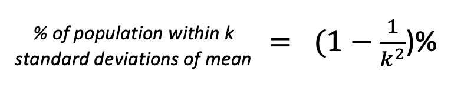

# DATA_310_Lab2

## Question 1
This question requires the application of Chebyschev's Theorem. Regardless of the distribution of the data, this theorem allows you to calculate the minimum percentage of the population that will be contained within *k* standard deviation around the mean. The theorem relies on the following formula:

#### Applying this Formula in Code:

    k = 8
    (1-1/(k*k))*100

When you run this code, you recieve an output of 98.4375%. Therefore, at least 98.4375% of the population will reside within 8 standard deviations of the mean for all types of distributions.

## Question 2
This question looks at the relationships between the different scaling methods. However, quantile scaling does not rely on z-scores. Rather, it is more accurately related with percentile calculation. Namely, a quantile is a chunk of data that lies in between two percentiles. Therefore, if one was trying to find out what quantile a data value fit into, they would first want to find the percentile of the data point and sort it accordingly.

## Question 3
By definition, a z-score is the number of standard deviations a data value is above/below the mean. (If the z-score is negative, it lies below the mean, and if positive, it lies above the mean.) Therefore, a z-score is determined by the following formula:

A z-score can be a useful tool because they do not have a physical unit. Therefore, it can allow for easier omparisons between two variables that lie on vastly different scales (such as height and income).

#### Applying this Formula in Code:

    mpg = data.mpg.values
    zs = (18.1-np.mean(mpg))/np.std(mpg)

When you run this code, the variable *zs* comes to equal -0.3356. This means that a value of 18.1 mpg is .03356 standard deviations below the mean of all gas mileages in the dataset.

## Question 4

## Question 5

## Question 6

## Question 7

## Question 8

## Question 9

# Question 10
