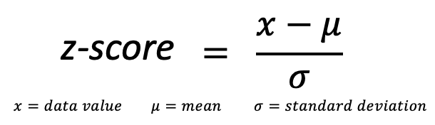

# DATA 310: LAB 2
## Question 1
This question requires the application of Chebyschev's Theorem. Regardless of the distribution of the data, this theorem allows you to calculate the minimum percentage of the population that will be contained within *k* standard deviations around the mean. The theorem relies on the following formula:

##### Applying this Formula in Code:

    k = 4
    (1-1/(k*k))*100

When you run this code, you recieve an output of 93.75%. Therefore, at least 93.75% of the population will reside within 4 standard deviations of the mean for all types of distributions. (In other words, 93.75% of the population will reside within a span of 8 standard deviations centered around the mean.)

## Question 2
This question looks at the relationships between the different scaling methods. However, quantile scaling does not rely on z-scores. Rather, it is more accurately related with percentile calculation. Namely, a quantile is a chunk of data that lies in between two percentiles. Therefore, if one was trying to find out what quantile a data value fit into, they would first want to find the percentile of the data point and sort it accordingly.

## Question 3
By definition, a z-score is the number of standard deviations a data value is above/below the mean. (If the z-score is negative, it lies below the mean, and if positive, it lies above the mean.) Therefore, a z-score is determined by the following formula:

A z-score can be a useful tool because they do not have a physical unit. Therefore, it can allow for easier comparisons between two variables that lie on vastly different scales (such as height and income).

##### Applying this Formula in Code:

    mpg = data.mpg.values
    zs = (18.1-np.mean(mpg))/np.std(mpg)

When you run this code, the variable *zs* comes to equal -0.3356. This means that a value of 18.1 mpg is .03356 standard deviations below the mean of all gas mileages in the dataset.

## Question 4
The definition of a percentile is the percent of observations that fall below a certain value. In this case, it is the percent of cars that would have a weight below 3520 lbs. In order to find this value, I first looked at an ordered list of all of the car weights in the dataset:

    wts = [1.513, 1.615, 1.835, 1.935, 2.14 , 2.2  , 2.32 , 2.465, 2.62 ,
       2.77 , 2.78 , 2.875, 3.15 , 3.17 , 3.19 , 3.215, 3.435, 3.44 ,
       3.44 , 3.44 , 3.46 , 3.52 , 3.57 , 3.57 , 3.73 , 3.78 , 3.84 ,
       3.845, 4.07 , 5.25 , 5.345, 5.424]

As you can see, a value of 3.52 tons is the 22nd data point out of 32 (22/32 = 68.75%) Therfore, I knew that the percentile for a weight of 3520 lbs. would be close to 68.75%; however, it would likely be lower than this value due to the fact that the percentile for 3520 lbs. would be the percentage of cars having a lower weight that that, not including cars at that weight. Therefore, I tested some percentiles using the following code:

    wt = data.wt.values
    np.percentile(wt,68)  ### output: 3.524
    np.percentile(wt,67)  ### output: 3.325

I found that the percentile for 3.52 tons would fall between 67 and 68, and I rounded up to a percentile of 68 per the question's instruction.

## Question 5
The fact that *"A finite sum of squared quantities that depends on some parameters (weights), always has a minimum value"* is the basis for the Ordinary Least Squares Technique. In practice, this concept allows for an optimal linear model to be found by determining the line that would minimize the squares of the residual values. 

## Question 6
To answer this question, I first fit a linear model to the data, allowing for an input of weight and an output of mileage. Then, I used this model to predict the mileage of a car whose weight is 2800 lbs. I did this by using the following code:

    from sklearn import linear_model
    x = data[['wt']]
    y = data[['mpg']]
    lm = linear_model.LinearRegression()
    model = lm.fit(x,y)
    lm.predict([[2.8]])  ### output: 22.32
    
Therefore, I discovered that a linear regression model for this dataset would predict a mileage of 22.32 mpg for a car weighing 2800 lbs.

## Question 7
The gradient desent algorithm uses iteration in order to determine the slope of a linear model that would minimize the sum of the squares of the residual values. It begins at a base slope/intercept and repeatedly tests values, improving it's guess with each iteration. In the algorithm we used in class, we calculated the optimal values by minimizing the cost function. Therefore, all that I had to do was eliminate the 1/2N coefficient in order to get the raw sum of the squared residuals. I did this by slightly modifiying the compute cost function to the following:
 
    def compute_cost(b, m, data):
        total_cost = 0
        N = float(len(data))
        for i in range(0, len(data)):
            x = data[i, 0]
            y = data[i, 1]
            total_cost += (y - (m * x + b)) ** 2
        return total_cost
        
Then, keeping the other functions from class the same, I ran the following code to determine the sum of the squared residuals:

    b, m, cost_graph,b_progress,m_progress = gradient_descent(data, 0, 0, 0.01, 10000)
    compute_cost(b, m, data)  ### returned output: 278.322

## Question 8
Determing the line of best fit does not need to have a seperate, complex calculation for the intercept. Because the line must run through the center of mass (coordinate of mean of x, mean of y), once a slope is calculated, it is easy to determine the intercept with a simple application of the point-slope form of a linear equation.

## Question 9
The intercept for the 'mtcars' data set has no meaning because it is not logical to determine a mileage for a car that weighs 0 lbs. This situation would not occur in real life and is not a rational piece of information.

## Question 10
The slope of the regression line can change if z-score scaling is done because of the different scales of data. If, for example, the original data regarded the weight of heavy objects or the height of tall buildings, bringing such data to a univeral scale of z-scores would drastically change the magnitude of the line's slope. 
